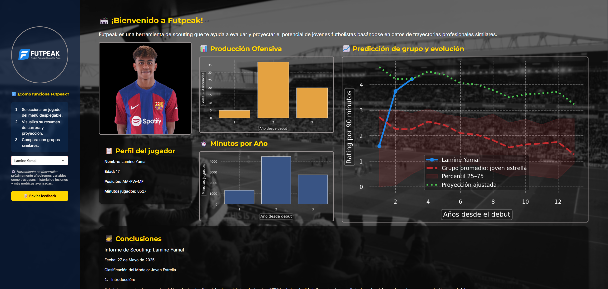

<p align="center">
  <a href="https://futpeak.streamlit.app/">
    
  </a>
</p>

<h1 align="center">
  <a href="https://futpeak.streamlit.app/" style="text-decoration: none; color: inherit;">⚽ Futpeak</a>
</h1>

<p align="center">
  <strong>Predict Potential. Reach the Peak.</strong><br>
  Herramienta de scouting que proyecta el rendimiento futuro de jóvenes futbolistas.
  (Haz click en el nombre de la app, el banner o la demo visual para acceder a la página)
</p>


---

## 🧭 Tabla de Contenidos

- [🔍 Descripción](#-descripción)
- [🎥 Demo visual](#-demo-visual)
- [✨ Funcionalidades](#-funcionalidades)
- [🛠️ Instalación](#-instalación)
- [📁 Estructura del proyecto](#-estructura-del-proyecto)
- [🧠 Modelo de predicción](#-modelo-de-predicción)
- [🚧 Roadmap](#-roadmap)
- [🤝 Contribuciones](#-contribuciones)
- [📄 Licencia](#-licencia)

---

## 🔍 Descripción

**Futpeak** es una aplicación interactiva que ayuda a evaluar y proyectar el potencial de jóvenes futbolistas basándose en datos de carrera y trayectorias similares. Utiliza técnicas de machine learning y curvas de evolución promedio para predecir el desarrollo futuro de un jugador.

> 💡 Pensado para clubes, analistas y agencias que buscan tomar decisiones de scouting basadas en evidencia.

---

## 🎥 Demo visual

<p align="center">
  <a href="https://futpeak.streamlit.app/">
    
  </a>
</p>

---

## ✨ Funcionalidades

- 📈 Proyección del rendimiento ajustada por trayectoria
- 🧬 Comparación con grupos de jugadores similares
- 🔍 Visualización de producción ofensiva, minutos y rating por 90 minutos
- 🧑‍💻 App desplegada en Streamlit con diseño responsivo
- 🛡️ Curvas con percentiles y bandas de confianza (25–75)

---

## 🛠️ Instalación

```bash
# Clona el repositorio
git clone https://github.com/JuanmaCM7/Futpeak.git
cd Futpeak

# Crea un entorno virtual
python -m venv venv
source venv/bin/activate  # o .\venv\Scripts\activate en Windows

# Instala las dependencias
pip install -r requirements.txt

# Ejecuta la app
streamlit run src/app.py
```
---

## 📁 Estructura del proyecto
```
Futpeak/
├── model/
│ └── curvas_promedio.joblib
├── notebooks/
├── src/
│ ├── app.py
│ ├── model_runner.py
│ ├── stats.py
│ ├── assets/
│ │ └── player_faces/
├── requirements.txt
├── README.md
├── Banner.png
└── App.png
```
---

## 🧠 Modelo de predicción

🎯 Clasificador multiclase RandomForest entrenado con trayectorias de cientos de jugadores

📊 Ajuste de proyección basado en rating real vs. curva promedio

🔄 Análisis temporal desde el debut profesional

📉 Incorporación futura de variables como lesiones, traspasos y minutos acumulados

---

## 🚧 Roadmap

 ✅ Visualización de rendimiento por temporada

 ✅ Proyección automática con ajuste personalizado

 📅 Incorporación de traspasos y lesiones

 📅 Nuevos modelos por posición específica

 📅 Exportación de informes PDF

 📅Dashboard para clubes y agentes

---

## 🤝 Contribuciones

¿Ideas o mejoras? Abre un issue o déjame un correo en juacanom@gmail.com
Toda ayuda es bienvenida para mejorar la herramienta.

---

## 📄 Licencia

Este proyecto no está licenciado como software libre.

Todos los derechos reservados © 2025 JuanmaCM7.  
No está permitido copiar, modificar ni redistribuir el código sin consentimiento previo por escrito del autor.

---